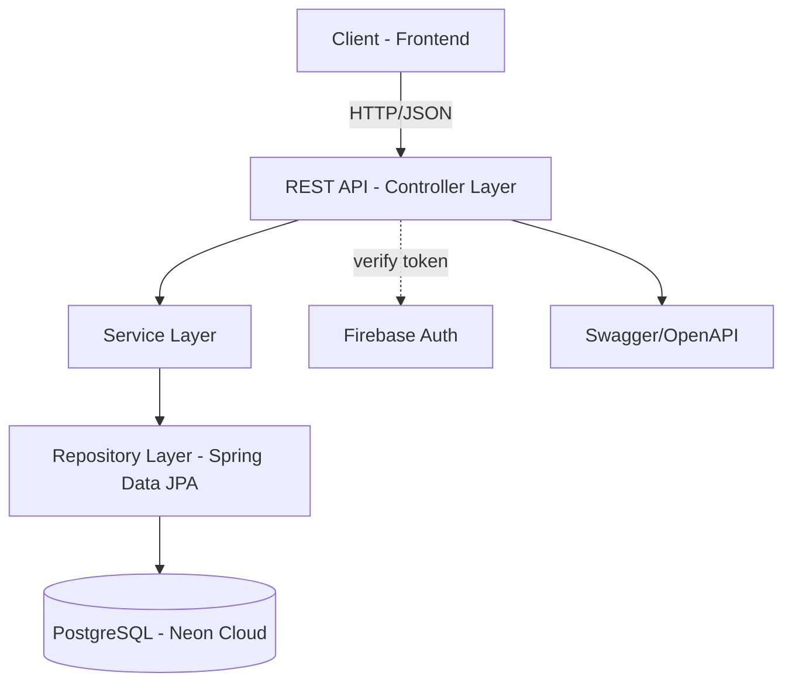

<!-- ตำแหน่งที่รับผิดชอบไฟล์นี้: System Architecture & Cloud/DevOps -->
<!-- เติม: ชื่อ service/container ที่ deploy จริง, connector ที่ต่อกับ Cloud/Auth จริง -->

# Component Diagram

<!-- คำอธิบายสั้นๆ ว่า component ไหนทำหน้าที่อะไร (2-3 บรรทัด) -->

<!-- แก้กล่อง/เส้นด้านบนให้ตรงกับ deploy จริง เช่น ถ้ามี Cache/Queue/Storage เพิ่ม ให้ใส่ต่อ -->
