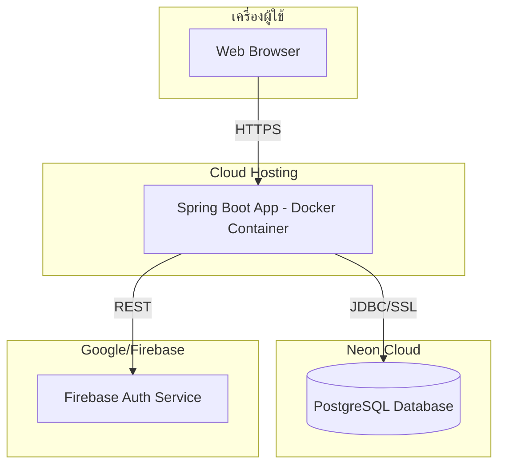

<!-- ตำแหน่งที่รับผิดชอบไฟล์นี้: System Architecture & Cloud/DevOps -->
<!-- เติม: ชื่อ platform hosting จริง (Render/Railway/ฯลฯ), URL จริงหลัง deploy -->

# Deployment Diagram

<!-- คำอธิบายสั้นๆ ว่า deploy ยังไง ใช้ platform อะไร (2-3 บรรทัด) -->

<!-- เปลี่ยนชื่อ "Cloud Hosting" เป็นชื่อ platform จริงที่ใช้ deploy -->
<!-- ถ้ามี CI/CD (GitHub Actions) ให้เพิ่ม subgraph แยกแสดง pipeline ด้วย -->
