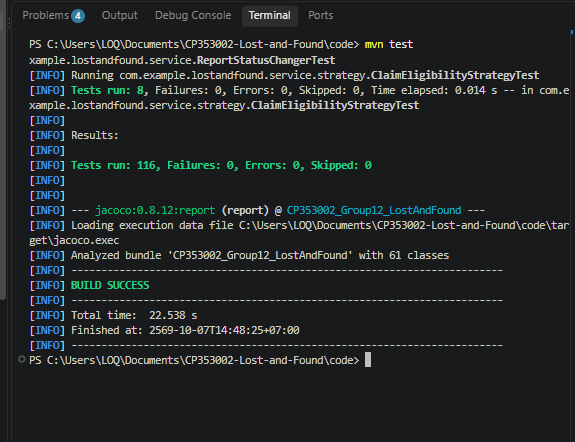
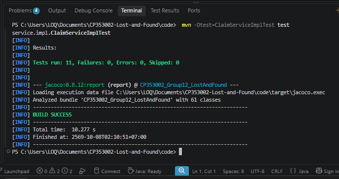
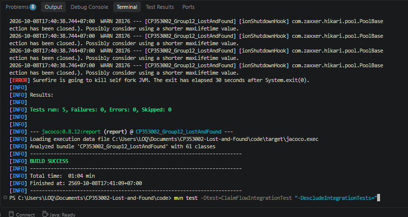
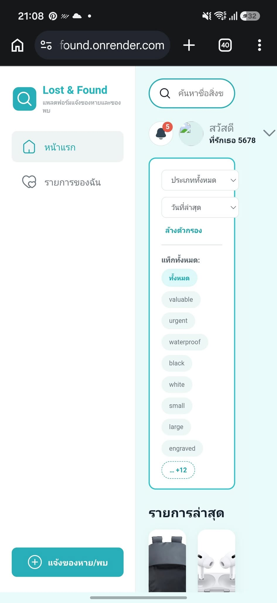

# Test Report — Lost and Found

## 1. Test Information

| รายการ         | รายละเอียด              |
| -------------- | ----------------------- |
| Project        | CP353002 Lost and Found |
| Tester         | Poranun                 |
| Branch         | `poranun_6733802763_02` |
| Test Framework | JUnit 5 + Mockito       |
| Application    | Spring Boot             |
| Java Version   | 17                      |
| Database       | Neon                    |
| Authentication | Firebase                |
| Test Date      | 2026-10-07              |

---

## 2. Test Objective

การทดสอบมีวัตถุประสงค์เพื่อตรวจสอบว่าระบบ Lost and Found สามารถทำงานได้ถูกต้องตาม Requirement ทั้งในส่วนของ Unit Test, Integration Test และ REST API รวมถึงตรวจสอบการจัดการข้อผิดพลาดของระบบ

---

## 3. Test Summary

| Metric | Result |
|---|---:|
| Total Tests | 116 |
| Passed | 116 |
| Failed | 0 |
| Error | 0 |
| Skipped | 0 |
| Result | PASS |


### Test Execution

คำสั่งที่ใช้ในการทดสอบ:

```bash
cd code
mvn test
```

ผลการทดสอบ:

```text
Tests run: [116]
Failures: 0
Errors: 0
Skipped: 0
```

### ภาพประกอบผลการทดสอบ



---

## 4. Test Coverage

| Metric | Coverage |
|---|---:|
| Instruction Coverage | 63% |
| Branch Coverage | 60% |
| Line Coverage | 62% |
| Method Coverage | 61% |
| Class Coverage | 82% |

---

## 5. ClaimServiceTest

การทดสอบ Unit Test ใช้ JUnit 5 และ Mockito เพื่อทดสอบการทำงานของ Service โดยแยกทดสอบแต่ละกรณีอย่างอิสระ

| Test Case | Expected Result | Result |
|---|---|---|
| Submit claim to open report (first claim) | Claim ถูกสร้างสำเร็จ และ Report เปลี่ยนเป็น MATCH_PENDING | PASS |
| Submit claim when report is already MATCH_PENDING | Claim ถูกสร้างสำเร็จ แต่ไม่เปลี่ยนสถานะ Report ซ้ำ | PASS |
| Submit claim to closed report | BadRequestException | PASS |
| Submit claim on own report | BadRequestException | PASS |
| Submit duplicate pending claim | ConflictException | PASS |
| Approve claim | Claim เป็น APPROVED, Claims อื่นเป็น REJECTED และ Report เป็น CLAIMED | PASS |
| Approve claim by non-owner | ForbiddenException | PASS |
| Approve already-decided claim | BadRequestException | PASS |
| Reject claim with no remaining pending/approved claims | Claim เป็น REJECTED และ Report กลับเป็น OPEN | PASS |
| Reject claim while other claims remain | Claim เป็น REJECTED แต่ Report ยังคง MATCH_PENDING | PASS |
| Reject claim by non-owner | ForbiddenException | PASS |

### ภาพประกอบผลการทดสอบ



--- 

## 6. Integration Test

Integration Test ใช้ตรวจสอบการทำงานร่วมกันของส่วนต่าง ๆ ของระบบ โดยใช้ Testcontainers สำหรับ PostgreSQL

| Test Case | Expected Result | Result |
|---|---|---|
| Create report | Report created | PASS |
| Submit claim | Claim created | PASS |
| Retrieve claim | Correct claim returned | PASS |
| Invalid claim flow | Request rejected | PASS |

### ภาพประกอบผลการทดสอบ



---

## 7. API Test

ทดสอบ REST API ผ่าน Swagger โดยตรวจสอบทั้งกรณีปกติและกรณีผิดพลาด

### API Testing

| Test ID | HTTP Method | Endpoint | วัตถุประสงค์ | Preconditions / Test Data | Expected Result | Actual Status | Result | 
|---|---|---|---|---|---|---|---|
| API-01 | POST | `/api/v1/auth/register` | สมัครสมาชิกใหม่ | ใช้อีเมลทดสอบที่ยังไม่เคยสมัคร; Request body ตาม Swagger Schema | สมัครสำเร็จตาม Response ที่ API กำหนด; ข้อมูลไม่ครบ/ผิดรูปแบบถูกปฏิเสธ | 201 Created | PASS | 
| API-02 | POST | `/api/v1/auth/login` | เข้าสู่ระบบและรับ Token | ใช้บัญชีทดสอบที่สมัครแล้ว | ข้อมูลถูกต้องแล้ว Login สำเร็จและคืน Token ตาม Schema; รหัสผ่านผิดถูกปฏิเสธ | 200 OK | PASS | 
| API-03 | POST | `/api/v1/auth/google` | Login ผ่าน Google/Firebase | ต้องมี Google/Firebase ID Token ที่ถูกต้อง | ยืนยันตัวตนสำเร็จตาม Response Schema; Token ไม่ถูกต้องถูกปฏิเสธ | 200 | PASS | 
| API-04 | GET | `/api/v1/users/me` | ดูโปรไฟล์ผู้ใช้ปัจจุบัน | Token ของบัญชีทดสอบ | คืนข้อมูลของผู้ใช้ที่ Login อยู่; ไม่มี/Token ผิดถูกปฏิเสธหาก Endpoint ต้องยืนยันตัวตน | 200 | PASS | 
| API-05 | PUT | `/api/v1/users/me` | แก้ไขโปรไฟล์ผู้ใช้ | Token ของบัญชีทดสอบ; Request body ตาม Swagger | บันทึกข้อมูลที่แก้ไขได้และ GET โปรไฟล์ซ้ำแล้วเห็นค่าที่เปลี่ยน | 200 | PASS |  
| API-06 | POST | `/api/v1/reports` | สร้างประกาศของหาย/ของพบ | Token บัญชี A; Request body ตาม Schema | สร้างประกาศสำเร็จและคืน ID สำหรับใช้ทดสอบต่อ | 201 Created | PASS |
| API-07 | GET | `/api/v1/reports` | ดูรายการประกาศ | ไม่จำเป็นต้องมีข้อมูลล่วงหน้า; Query parameters ตาม Swagger ถ้ามี | คืนรายการและ Pagination/Sorting ตามที่ API รองรับ | 200 OK | PASS | 
| API-08 | GET | `/api/v1/reports/{id}` | ดูรายละเอียดประกาศ | `id` ของประกาศที่มีอยู่ | คืนรายละเอียดที่ตรงกับประกาศ; ID ที่ไม่มีอยู่ถูกจัดการตาม API | 200 OK | PASS |
| API-09 | POST | `/api/v1/reports/{id}/watch` | ติดตามประกาศ | Token บัญชีทดสอบ; `id` ที่มีอยู่ | เพิ่มรายการติดตามสำเร็จตามกติกา API | 200 OK | PASS | 
| API-10 | DELETE | `/api/v1/reports/{id}/watch` | เลิกติดตามประกาศ | ใช้บัญชีเดียวกับที่ติดตาม และ `id` เดิม | นำรายการออกจาก watch list สำเร็จตามกติกา API | 204 | PASS | 
| API-11 | POST | `/api/v1/reports/{id}/claims` | ยื่นคำขอ Claim | Token บัญชี B; `reportId` ของประกาศที่เปิดอยู่และไม่ใช่ของ B; body ตาม Schema | สร้าง Claim สำเร็จและคืน ID; กรณีผิดกติกาถูกปฏิเสธ | 201 | PASS | 
| API-12 | GET | `/api/v1/claims/me` | ดู Claim ของตนเอง | Token บัญชีผู้ยื่น Claim | คืน Claim ของผู้ใช้ปัจจุบัน | 200 | PASS |
| API-13 | PATCH | `/api/v1/claims/{id}/approve` | อนุมัติ Claim | Token เจ้าของประกาศ A; `claimId` ที่ยังรอการตัดสิน | อนุมัติสำเร็จและสถานะเปลี่ยนตามกติกาธุรกิจ; ผู้ไม่มีสิทธิ์ถูกปฏิเสธ | 200 | PASS | 
| API-14 | DELETE | `/api/v1/admin/reports/{id}` | ลบประกาศโดย Admin | Token Admin; ID ของประกาศทดสอบที่อนุญาตให้ลบ | ลบสำเร็จตาม Response ที่ API กำหนด; บัญชีทั่วไปไม่มีสิทธิ์ถูกปฏิเสธ | 204 | PASS | 
| API-15 | GET | `/api/v1/categories` | ดูรายการหมวดหมู่ | ไม่มี | คืนรายการหมวดหมู่ | 200 | PASS | 
| API-16 | POST | `/api/v1/categories` | เพิ่มหมวดหมู่ | Request body ตาม Schema; ใช้ชื่อทดสอบไม่ซ้ำ | เพิ่มสำเร็จและคืนข้อมูล/ID ตาม Response | 201 | PASS | 
| API-17 | GET | `/api/v1/tags` | ดูรายการแท็ก | ไม่มี | คืนรายการแท็ก | 200 | PASS | 
| API-18 | POST | `/api/v1/tags` | เพิ่มแท็ก | Request body ตาม Schema; ใช้ชื่อทดสอบไม่ซ้ำ | เพิ่มสำเร็จและคืนข้อมูล/ID ตาม Response | 201 | PASS | 
| API-19 | GET | `/api/v1/notifications` | ดูการแจ้งเตือนของผู้ใช้ | Token ของบัญชีทดสอบ | คืนรายการแจ้งเตือนของผู้ใช้ปัจจุบัน; รายการว่างไม่ถือว่าล้มเหลวโดยอัตโนมัติ | 200 | PASS | 
| API-20 | PATCH | `/api/v1/notifications/{id}/read` | ทำเครื่องหมายการแจ้งเตือนว่าอ่านแล้ว | Token ของเจ้าของ Notification; ID ที่มีอยู่ | เปลี่ยนสถานะอ่านแล้วตามที่ API กำหนด | 200 | PASS | 
| API-21 | POST | `/api/v1/uploads` | อัปโหลดไฟล์/รูปภาพ | ไฟล์ทดสอบชนิดและขนาดที่รองรับ; body ตาม Swagger | อัปโหลดสำเร็จและคืน file ID/URL/ข้อมูลตาม API | 201 | PASS | 
| API-22 | GET | `/api/v1/files/{id}` | เปิด/ดาวน์โหลดไฟล์ | ID/identifier ที่ได้จาก API-23 | คืนไฟล์หรือ URL/response ตามการออกแบบของ API | 200 | PASS |

---

## 8. Authentication Testing

| Test Case | Expected Result | Result |
|---|---|---|
| Login with valid credentials | Login successful | PASS |
| Login with invalid credentials | Authentication rejected | PASS |
| Access protected API without token | 401 Unauthorized | PASS |
| Access API with valid token | Request accepted | PASS |
| Access API without sufficient permission | 403 Forbidden | PASS |

---

## 9. Frontend Functional Testing

| Test Case | Expected Result | Result |
|---|---|---|
| User login | Dashboard displayed | PASS |
| Search lost/found item | Matching results displayed | PASS |
| Create lost item report | Report created | PASS |
| Create found item report | Report created | PASS |
| View My Items | User's items displayed | PASS |
| Update account information | Information updated | PASS |

---

## 10. Bug Report

### BUG-01: รูปโปรไฟล์ผู้ใช้ไม่แสดงผล

- **ประเภท Bug:** ปัญหาการแสดงรูปภาพ
- **ส่วนที่พบปัญหา:** ส่วนข้อมูลผู้ใช้บนหน้าแรก
- **อุปกรณ์ที่ใช้ทดสอบ:** โทรศัพท์มือถือ Android
- **ขั้นตอนการทดสอบ:**
  1. เข้าสู่ระบบเว็บไซต์ Lost & Found
  2. เปิดหน้าแรกของเว็บไซต์
  3. ตรวจสอบรูปโปรไฟล์ที่อยู่ข้างชื่อผู้ใช้
- **ผลลัพธ์ที่คาดหวัง:** ระบบควรแสดงรูปโปรไฟล์ของผู้ใช้ได้อย่างถูกต้อง
- **ผลลัพธ์ที่เกิดขึ้นจริง:** เมนูด้านซ้ายและเนื้อหาหลักแสดงผลอยู่ข้างกัน ทำให้พื้นที่แสดงเนื้อหาด้านขวามีขนาดแคบและดูไม่เหมาะสมกับหน้าจอโทรศัพท์มือถือ
- **ระดับความรุนแรง:** ต่ำ
- **สถานะ:** แก้ไขแล้ว

### ภาพประกอบผลการทดสอบ 



